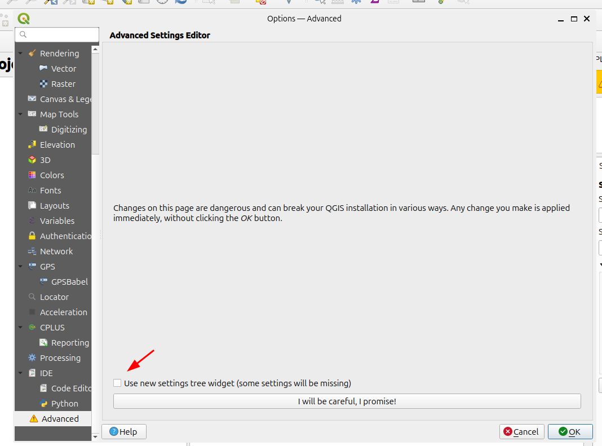
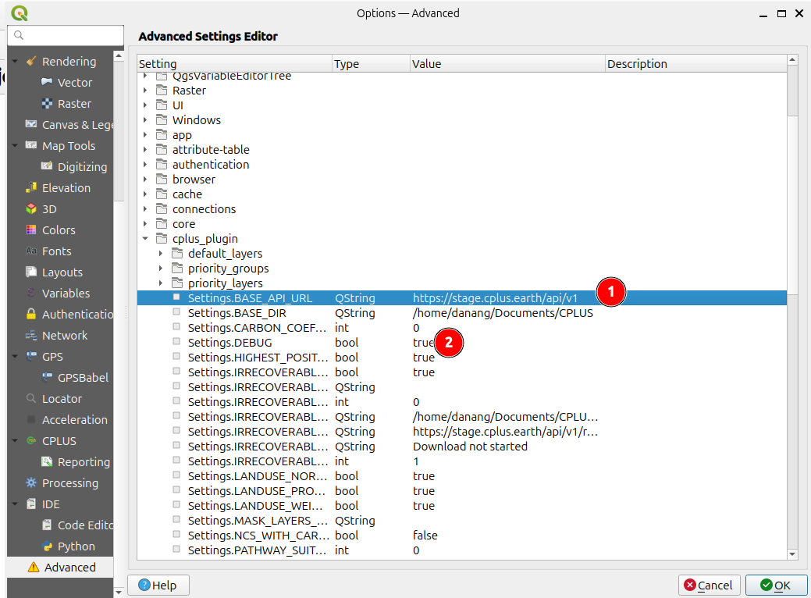
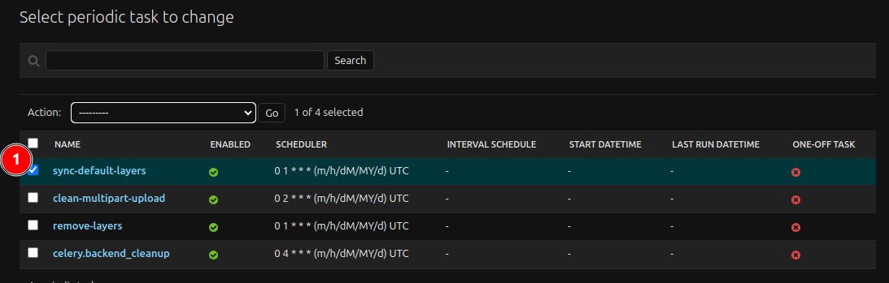

# CPLUS API for CPLUS QGIS PLUGIN

## 📚 Documentation
For detailed setup instructions, custom configurations, deployment, and additional features, please refer to the wiki.


### 🛠️ Development 

To run the API for development purposes, clone the repository locally, and run the containers using VSCode + Dev Container extension.
Also ensure you have docker installed.

1. Copy .template.env to .env

```
cp deployment/.template.env deployment/.env
```

2. Open project root directory in VSCode

3. Execute Task: `Dev Containers: Rebuild and Reopen in Container`

4. Wait until VSCode builds the containers


#### Post Build

Once the containers are running, we need to run migration and create a superuser.

1. Open Terminal in VSCode and go to `django_project` directory

```
cd django_project
```

2. Run migration

```
python manage.py migrate
```

3. Create superuser

```
python manage.py createsuperuser
```


#### Running the API

We can run the API using runner configration in VSCode `Django: Run server`.

1. Go to Run and Debug view.

2. Select `Django: Run Server` in the dropdown list.

3. Click Start Debugging Button  ▶

4. The API swagger is running and can be accessed in `http://localhost:8000/`

5. Login to Django Admin in `http://localhost:8000/admin/`


#### Use Local CPLUS API in QGIS Plugin

1. Open QGIS Advanced Settings Editor (Ensure not using tree widget)



2. Edit `Settings.BASE_API_URL` (1), to `http://localhost:8000/api/v1`



3. Optional - Set DEBUG to true (2) 


#### Syncing Default Layers

CPLUS API needs default layers for online processing. The layers are provided by the CI Team and it's uploaded to AWS S3 bucket. The other layer type is Nature Base layers which are downloaded by cron job.

For CPLUS layers, we need to upload the layers in Minio `cplus` bucket with below structures:

```
common_layers/
├── ncs_carbon/
│   ├── cplus/
│   │   └── Bou_SOC_norm_inverse.tif  
│   └── naturebase/
├── ncs_pathway/
│   ├── cplus/
│   │   └── Agroforestry_Priority_norm.tif
│   └── naturebase/
└── priority_layer/
│   ├── cplus/
│   │   └── Biodiversity.tif
│   └── naturebase/
```

Then we can trigger below task to sync into InputLayers table.




## 🤝 Contributing
Contributions are welcome! Please read our contributing guide to learn how you can get involved and help improve this project.

## 📄 License
This project is licensed under the MIT License. See the LICENSE file for details.
